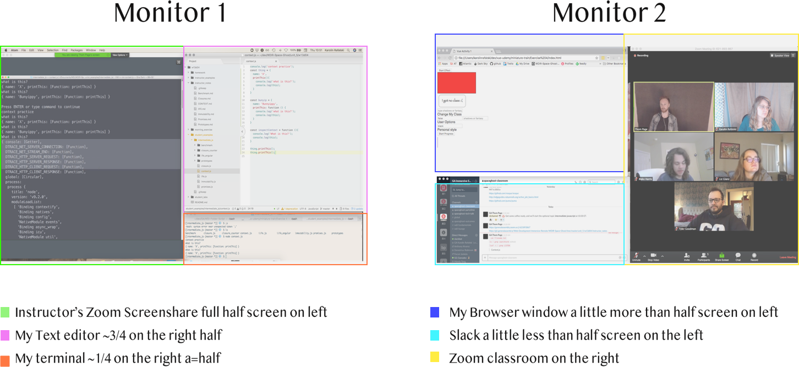

## Lesson Objectives

_After this lesson, students will be able to:_

1. Describe basic aspects of how classes will work
1. Download and install software necessary for the first unit of the course

## Describe basic aspects of how classes will work

- Lesson headers
	- Headers will be posted for all lessons and labs with links to markdowns and the Zoom channel
- Markdown
  - Markdown is a type of markup language, like HTML, that is more lightweight than HTML, and is used for documentation on github. [More Info](https://en.wikipedia.org/wiki/Markdown)
 [Cheatsheet to learn how to write your own markdown](https://github.com/adam-p/markdown-here/wiki/Markdown-Cheatsheet)
	- Markdown contains reference material related to the lesson
- Sharing screen
	- The instructor will screenshare for demonstration purposes. Double-click out of fullscreen.
- Screen real-estate: markdown, zoom, text editor, terminal, slack
	- Command-tab to cycle applications
- Muting
	- Be muted unless speaking
- Asking questions
	- Ask away! Either in Slack or out loud
- Visibility of instructor code
	- Speak up if the instructor's code is not visible (eg. too small).
- Thumbsups
	- We use the thumbsup emoji to gauge completeness of exercises and the pace of the lesson. Click on the thumb when you are done with an exercise.

## Download and install software necessary for the class

- Atom installed? Or your favorite text editor.
	- [Download Atom](https://atom.io/)
- Node installed?
	- [Current version](https://nodejs.org/en/download/current/), **not** LTS
	- Click on "Macintosh Installer"
	- Install the package

- Chrome installed and set as default?
 - on top right click 'more' (3 dots), choose settings, and scroll down to 'Default browser' - we will be using 'Chrome Developer Tools' throughout the course, and while other browsers off similar tools, they can look quite different so it'll be easier to follow along if we are all on the same browser.

 - Signed up for github enterprise and submitted username? You will not be able to have access to the class repository and the notes/resources there without it.

 ## Get Into Good Habits Today

 We'll keep helping you develop good work flows, but you have to practice them!

 Taking the time to learn better ways to do things (keyboard shortcuts, organizing your windows), takes more time up front but will save you time, make you more efficient and let you stay focused on your work, rather than spending time getting to your work).

 - Organize your windows. Whenever you are coding along in class or working on a project, you must be able to easily click between windows and start working in a new one. You should not be dragging/resizing/minimizing every single time you need to change between programs

 You'll find you'll have to adjust depending on the project/which programs you are actively using

 Here is an example set up:

 

 The most important thing to note is that all windows are visible and there is no need to resize/minimize every time you have to switch

 ## Typing

 Sometimes students have trouble keeping up with the code alongs - the number one culprit is window management.

 The second one is getting used to typing code.

 Type "Learn to type for free" - there are a lot of programs. Find the one that suits your style and needs. Additionally there is [typing.io](https://typing.io/) which is focused on helping you type code. Even 5 minutes a day (while you are waiting for your coffee to cool to the perfect temp!) can help a lot!
