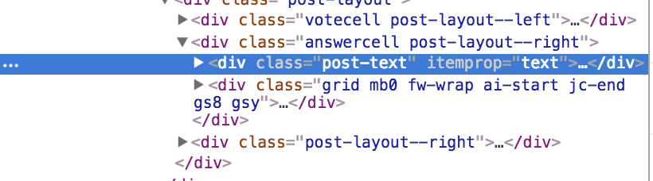
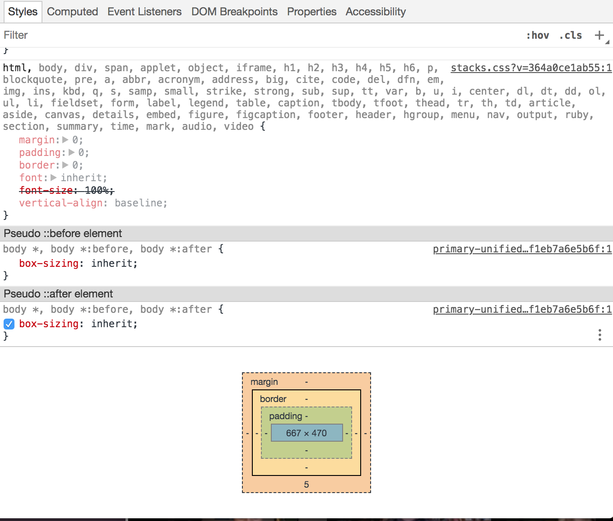
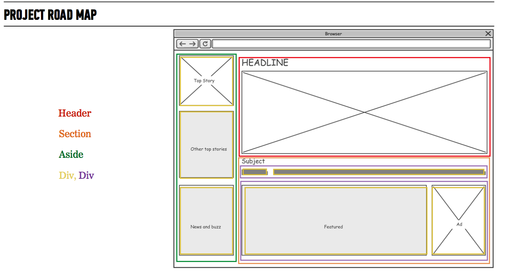

# Tips For Success

## Web inspector

### Using the Inspector for CSS

We have been using the web inspector to log to the console and to check for Javascript errors. The Web inspector has many other features that can help on your journey as a developer.

**How to use the CSS web inspector**

1. Open up the style tab on the right hand inspector module.
1. Open up the elements tab of your inspector module so you are able to see the elements on your page.
1. In the elements console click on the element you wish to look at. Once the element is clicked on it will turn blue.



1. Look at the right side styles module - this will now show the styles that are inherited by this element with the closest styles to the element at the top and the furtherest styles at the bottom (reverse waterfall).
1. In the style editor we are able to click on and off different styles by clicking on the checkbox next to each property!

_I use the style inspector all the time to figure out the styles I want to use! This saves me so much time!_

**Use the web inspector to see the box model**

1. When you are clicked on an element in the elements tab, scroll to the very bottom of the style module of your web inspector.
1. Here you will see a visual rendering of the elements box model. This can be a very helpful tool in understanding what the box model of your element looks like!




**Other resources**

Pesticide(http://pesticide.io/)


### Image Optimization

Users wait about 3 second for a website to load on a desktop or a laptop.

...and about 5 second on their mobile device.

Amazon found that if their pages slowed down by 1 second, they lose $1.6 billion a year!

Google uses page load as a factor for their ranking algorithm

**Image file size contribute's to the overall load time of your site! The larger the file size, the longer it will take for you website to load.**

#### Image Compression

There are two types of compression: **Lossy and Lossless**

* Lossy compression refers to compression in which some of the data from an original file (JPEG) is lost. Once you convert to lossy, the process is irreversible and you cant go back.

**File Types**: Jpeg, Gif
**Advantages**: Very small file sizes.
**Disadvantages**: Quality degrades with higher ratio or compression. Can't get original back after compressing.

* Lossless compression refers to compression in which the image is reduced without any quality loss. Usually this is done by re moving unnecessary metadata from PNG files.

**File Types**: RAW, BMP and PNG
**Advantages**: No loss in quality, slight decreases in image file sizes.
**Disadvantages**: Larger file sizes then using lossless compression.

**What does it all mean!!?**

when working on your website always make sure to crop your images and compress them.

I use [tiny png](https://tinypng.com/) to compress my images and it always saved me load time and maintains the quality of the images!

**Rules of thumb**

* Full page web images 80KB - 100KB at most.
* Part of a page (e.g. half the width of a blog post) 20kb-30kb is usually fine.

### Wireframe mapping!

Short and sweet tip I have picked up that has helped a lot of students is mapping out your wireframe to decide what elements should be on your HTML before you begin coding.



### Define Variables at the top of the page

In Jquery we often grab elements from the DOM. Then we are able to grab elements on the fly to access different parts of the DOM throughout our development.

However, when you are creating different elements for your page you should define the ones you will be working with at the top of the page otherwise each time you go to find the element you are calling `$('.post')` your browsers will traverse the DOM to find the element and show down your performance.

What we don't want to do:

```Javascript
$('.post').each( element =>{
  $('body').append(element);
});
```

Instead we want our code to be something like this:

```Javascript
let $body = $('body');
let $postDivs = $('.post');

$postDivs.each( element =>{
  console.log(element);
  $($body).append(element);
});
```

:)

## Freelancing

1. Contracts - Define scope in your contracts so you can refer back to it! No one wants scope creep!
1. 1/2 payment upfront!
1. Charge for content management!
1. Create a community of other developers/freelancers/designers!

# **Most important**
## Have fun and stay hungry to learn more! Don't follow all the rules!
