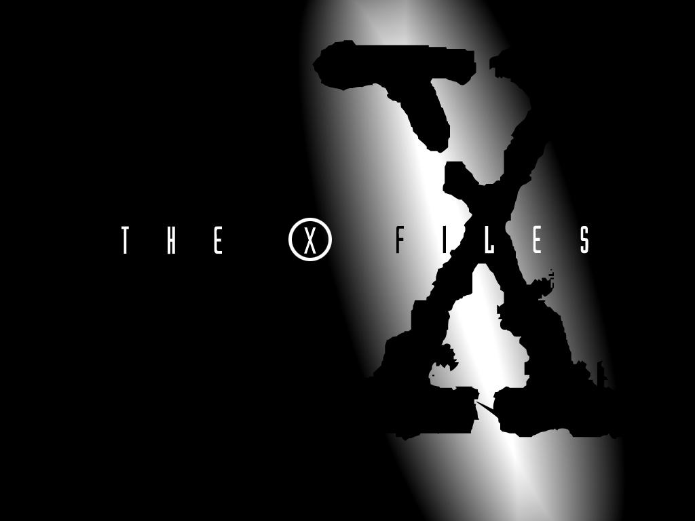
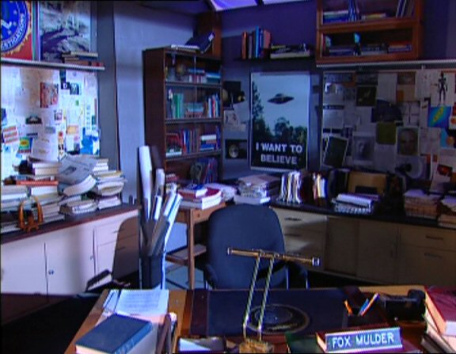

# First Contact



The FBI has resurrected the X-Files. Agent Mulder has resurfaced and his search for the truth remains unabated. *It is out there*.

In the years since Mulder's disappearance the digital age has brought with it treasure troves of information, both government and citizen. The FBI is still reluctant to invest too many resources into their investigations forcing Mulder and Skully to recruit a junior developer out of a bootcamp to help them make sense of all the newly available data.

You have been contracted by the scientifically rigorous Agent Skully to help in the quest for truth. You not only fit their aggressively mediocre budget, but also your profile is low enough that you can be eliminated without any repercussions—a dangerous combination.

## Part 1



Walking into the office you make yourself comfortable and start exploring their systems. Agent Scully has asked you to provide them with a way in which they would be able to list all UFO sightings in a given location. In your search you stumble upon a file called `sightings.json`. It looks promising and, after some investigation, it appears to have data about UFO sightings over the past year or so.

Write a command line application called `helper.js` which Scully can use to find all sightings within a given state. Have the application take one command line argument which contains the name of the state and log to the console a summary of each sighting in that state. For example:

<details><summary>Hints</summary>
1. require the `sightings.json` file as data

**helper.js**

```js
// access the data in this file
const sightingsData = require('./sightings.json')

// test it
console.log(sightingsData[0]) 

// expected output
// { date: '1/31/15 22:00',
//  city: 'Lancaster',
//  state: 'CA',
//  shape: 'Sphere',
//  duration: 'several minutes',
 // description: 'Orange lights.' }

```

1. Access the firsts argument from terminal

**Bash:** `node helper.js state=SC`


```js
// access the argument
const state = process.argv[2]

// test it
console.log(state) 

// expected output
// state=SC
```


</details>


```
=====================
Date: 1/31/15/ 21:30
City: Conway
State: SC
Shape: Fireball
Duration: 5 Minutes
====================
Date: 1/27/15 20:00
City: Myrtle Beach
State: SC
Shape: Changing
Duration: 10 Seconds
====================
.
.
.
```

Excited after immersing yourself in a beautiful combination of javascript and the possibilities of extraterrestrial visitation you decide to call it a job well done. But just as the sun begins to creep through the basement window your phone buzzes. Mulder and Skully are in Arkansas investigating the disappearance of man in a town where the residents really are what they eat. Mulder insists on an extraterrestrial connection based on reports of Foxfire near where the missing mans car was located. Also sometimes called "fairy fire", it is the bioluminescence created by some species of fungi present in decaying wood, *but* is often reported in conjunction with UFO sightings.

Find all the UFO sightings in that state for the past year to help out your new colleagues.

Mulder and Skully, after some hesitation, have decided to accept you as a valuable resource and are as sure as they can be that your not bought by the Syndicate. They've requested that you extend your script to make the data even more accessible.

**BONUS**
Extend your application to accept different queries. Allow Scully to look for sightings by city, shape, duration.

For example

```sh
node helper.js shape=sphere
node helper.js city=Sherwood
```

**BONUS BONUS**
Implement composite query functionality, to incorporate `&` and date range functionality

For Example
```sh
node helper.js shape=sphere&date>05/01/2015
```
should give you all sphere sightings after May 2015.


## Part 2
Scully has finally taken pregnancy leave, working till the very last possible minute. Things have been going great until now and Scully has used your app to solve a multitude of cases. Unfortunately for you, Mulder has never touched a terminal in his life, "Is there any way I can get it off my fingers without betraying my cool exterior?"

He does, however, know how to use a browser and understands url query parameters. He wants you to implement the same functionality from before on a server, so he can access the information through the browser. He's given you the following spec:

The users request should go to `youripaddress/sightings[query]`. The user should be able to:

1. Request a list of UFOs by state
2. Request a list of UFOs by city
2. Request a list of UFOs by date
3. Request a list of UFOs by shape


### Bonus
1. Allow the user to send multiple parameters in their query string and return a list of sightings which matches only those parameters. If the user sends a request to
`youripaddress/sightings?shape=sphere&city=henderson&state nv` your server should respond with a list of all of the sphere shaped UFOs in Henderson, NV.
2. Format you response with html and css, so Mulder can go to Agent Skinner and justify the meager salary they've been paying you.

## Ultra Bonus
Scully and Mulder have encountered a bizarre case of a serial killer which could date back tens of years. They would like you to give them access to sighting information from the 80s. The file you luckily stumbled on only contains sightings from the last year. Agent Skinner has given you his personal guarantee that if you complete this assignment he will pull some strings and get you into the FBI field training program, so you can become a fully functioning member of the team. Soon you will be able to carry a gun and experience the paranormal first hand.

1. Your job is to find the information of all UFO sightings online (google might help).
2. Research how to use node to send http requests to that webpage (the `request` module might be useful)
3. Figure how to parse the html and get the relevant information for the sightings from there. (`cheerio` module might be useful here)
4. Allow for users to query your server and dynamically generate the responses by using the online resources directly.
