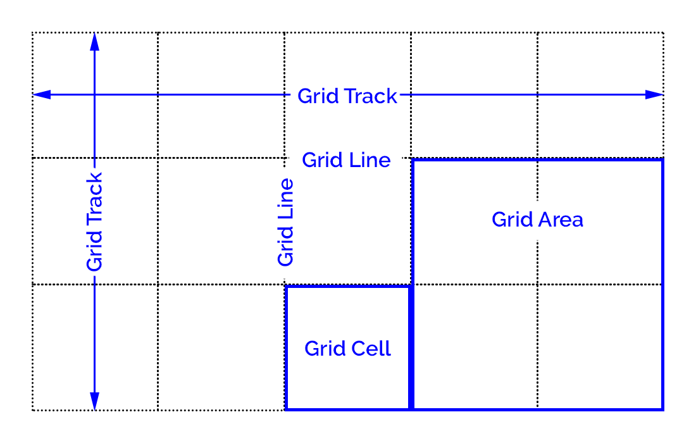

# CSS GRID

# Lesson Objectives

1. [What is CSS Grid?](#what-is-css-grid)
1. [Basic Terminology](#basic-terminology)
1. [Grid Container](#grid-container)
1. [Placing Grid Lines](#placing-grid-lines)
1. [Grid Areas](#grid-areas)
1. [Attaching Elements to the Grid](#attaching-elements-to-the-grid)
1. [Grid Item Overlap](#grid-item-overlap)
1. [Grid Spaces](#grid-spaces)
1. [Alignment](#alignment)
1. [Resources](#resources)

## What is CSS Grid

CSS grid is a generalized layout system with its emphasis on rows and columns.

## Basic Terminology



**Grid container** - An element that defines a grid-formatting context for its contents.

**Grid item** - A thing that participates in grid layout within a grid-formatting context.

**Grid track** - A continuous run between two adjacent grid lines. A grid row or column.

**Grid cell** - Any space bounded by four grid lines, with no grid lines running through it.

**Grid area** - Any rectangular area bounded by four grid lines and made up of one or more grid cells.

## Grid Container

index.html
```
<div class="container">
  <div id="item1" class=""> <p>Item 1</p> </div>
  <div id="item2" class=""> <p>Item 2</p> </div>
  <div id="item3" class=""> <p>Item 3</p> </div>
  <div id="item4" class=""> <p>Item 4</p> </div>
  <div id="item5" class=""> <p>Item 5</p> </div>
  <div id="item6" class=""> <p>Item 6</p> </div>
</div>
```

main.css
```
.container {
  display: grid;
}
```

## Placing Grid Lines

### Fixed-Width Grid Tracks

```
.container {
  grid-template-columns: 200px 50% 10em;
  grid-template-rows: 100px 200px;
}
```

### Flexible Grid Tracks

You can divide up the space into fractional units using `fr`.

```
grid-template-columns: 1fr 2fr 3fr;
```

### Content-Aware Tracks

```
grid-template-columns: 1fr max-content 3fr;
```
min-content
max-content

## Grid Areas

```
grid-template-areas:
  "header1 header2 header3"
  "content1 content2 content3"
  "footer1 footer2 footer3";
```

## Attaching Elements to the Grid

### Using Grid Lines

```
#item3 {
  grid-column-start: 1;
  grid-column-end: 2;
  grid-row-start: 1;
  grid-row-end: 2;
}
```

```
#item3 {
  grid-column-start: 1;
  grid-column-end: span;
}
```

### Using Named Grid Lines

```
.container {
  grid-template-columns: [one] 1fr [two] 3fr [biff] 2fr [stop-me];
}

#item3 {
  grid-column-start: one;
  grid-column-end: biff;
}
```

### Short hand

```
#item3 {
  grid-column: one / biff;
  grid-row: 1 / 3;
}
```

### Using Areas

```
#item1 {
  grid-area: footer2;
}

#item2 {
  grid-area: header3;
}

#item5 {
  grid-area: header1;
}
```

An item can cover more than one area using multiple areas.

```
#item5 {
  grid-area: header1 / header1 / content1 / header2;
}
```

You can set an area to cover more than one grid cell.

```
grid-template-areas:
  "header1 header1 header3"
  "content1 content2 content3"
  "footer1 footer2 footer3";

#item5 {
  grid-area: header1;
}
```

```
.container {
  grid-template-areas:
    "header1 header1 header3"
    "content1 content2 rightside"
    "footer1 footer2 rightside";
}

#item3 {
  grid-area: rightside;
}
```

## Grid Item Overlap

```
#item5 {
  grid-area: header1 / header1 / content1 / header3;
}
```

You can use `z-index` to order overlapping grid items. Elements with a higher `z-index` will be placed on top of elements with lower `z-index` values.

```
#item2 {
  grid-area: header3;
  z-index: 2;
}

#item3 {
  grid-area: rightside;
  z-index: 2;
}

#item5 {
  grid-area: header1 / header1 / content1 / header3;
  z-index: 0;
}
```

## Grid Spaces

A gutter, or gap, is the space between two grid tracks. You can set the gutter size in the grid container.

```
.container {
  grid-row-gap: 20px;
  grid-column-gap: 5em;
  grid-gap: 10px;
}
```

## Alignment

Grid items can be aligned both horizontally and vertically. Horizontal alignment is done with the `justify-*` properties and vertically with the `align-*` properties.

### Aligning a Grid Item

```
justify-self: [ start | left | center | end | right | stretch ]
align-self: [ start | left | center | end | right | stretch ]
```

```
#item {
  justify-self: start;
  align-self: end;
}

#item2 {
  justify-self: center;
  align-self: center;
}

#item4 {
  justify-self: stretch;
  align-self: stretch;
}
```

### Aligning All Items

```
justify-items: [ start | left | center | end | right | stretch ]
align-items: [ start | left | center | end | right | stretch ]
```

```
.container {
  justify-items: center;
  align-items: end;
}
```

### Aligning the Entire Grid

You can justify or align the entire grid. This may override any gap values you've set.

```
justify-content: [ start | left | center | end | right | space-between | space-around | space-evenly ]
align-content: [ start | left | center | end | right | space-between | space-around | space-evenly ]
```

```
.container {
  grid-template-columns: 100px 300px 200px;
  justify-content: center;

  grid-template-rows: 120px 40px 60px;
  min-height: 400px;
  align-content: center;
}
```

## Resources

[CSS-TRICKS A Complete Guide to Grid](https://css-tricks.com/snippets/css/complete-guide-grid/)

[Learn CSS Grid](https://learncssgrid.com/)

[Grid Garden (A game for learning grid)](https://cssgridgarden.com/)

[CSS Grid Changes EVERYTHING (YouTube)](https://www.youtube.com/watch?v=7kVeCqQCxlk)

"Grid Layout in CSS: Interface Layout for the Web" by Eric A. Meyer
